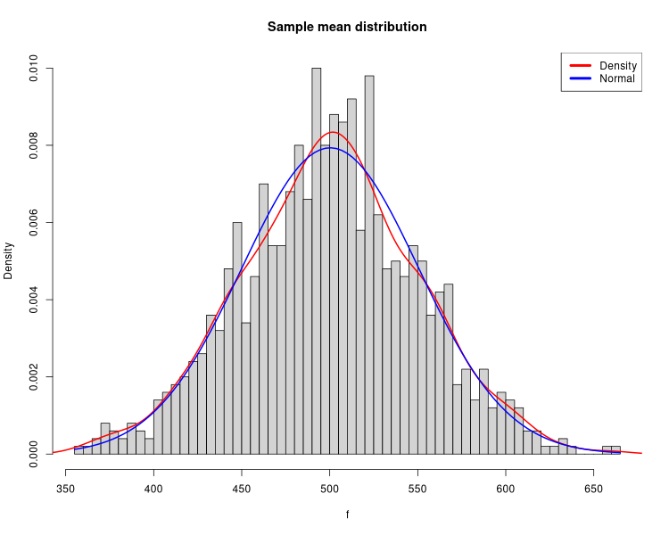

# Test Central Limit Theorem

From [Statistics Libre Text](https://stats.libretexts.org/Bookshelves/Introductory_Statistics/Introductory_Statistics_(Shafer_and_Zhang)/06%3A_Sampling_Distributions/6.02%3A_The_Sampling_Distribution_of_the_Sample_Mean):

> For samples of size 30 or more, the sample mean is approximately
> normally distributed, with mean 
> &mu;<sub>X</sub> = &mu;
> and standard deviation &sigma;<<sub>X</sub> = &sigma;/&#8730;n
> where n is the sample size.
> The larger the sample size, the better the approximation.

The above is a pretty typical assertion in statistics texts.
The derivation must be a doozy,
because there's rarely a discussion of the Central Limit Theory.

## Building and running

I wrote and tested this on Arch Linux, but Golang is pretty darn portable.
You should be able to try this on almost any distro with a [Go](https://go.dev/) compiler
and the [R statistical language](https://www.r-project.org/) installed.
You really only need R to get fancy histogram images.

```
$ make all
```

That will yield an executable, `samplings1`, an image in a file named `samples_dist.png`
a record of the samples of the population in `run.out`,
metadata about the population and samples in `run.metadata`.
The R "summary" of the means of the samples will be in `r.summary`.

#### Defaults

Executing `samplings1` will generate a population of values of 100,000,
whose values are between 0  and 1000.
It will take 1000 samplings, each with 100 values, from the population,
and calculate mean and standard deviation for each sampling.
It outputs the sum, the arithmetic mean and the standard deviation
for each sampling on stdout.


## Results



That's a density histogram of a run of `samplings`.
There were 100,000 values in the generated population.

The blue line is the normal curve for the mean and standard deviation of
the population.
The red line is R's `density` function for the means of the samplings.
I believe they're comparable as theoretic and experimental distributions.
